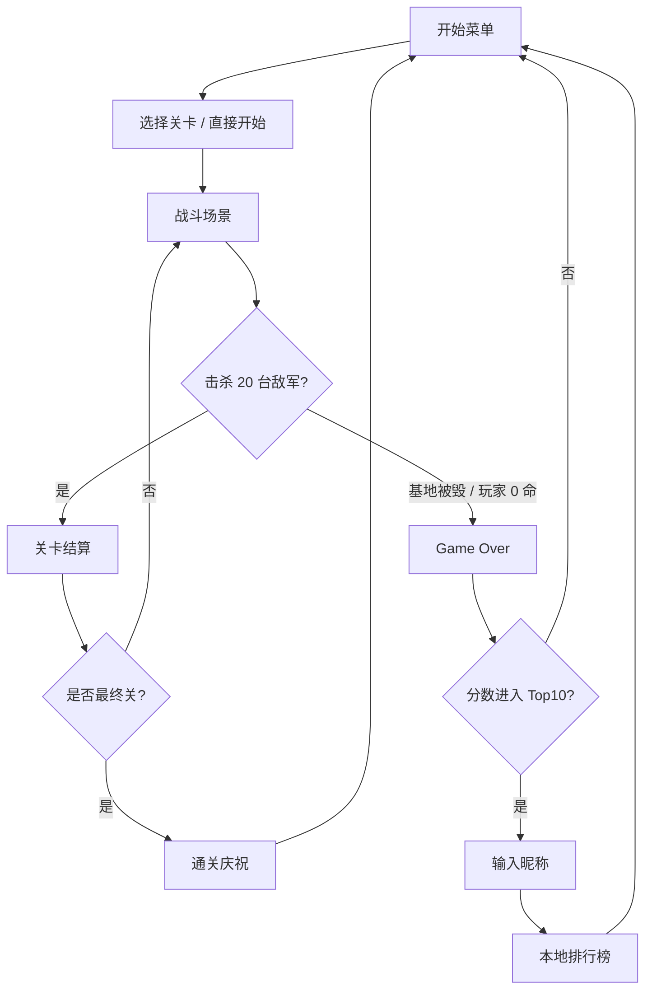

# 坦克大战 Web 版 · 产品需求文档 (PRD)

## 1. 产品概述
一款基于 Web 的复刻版"小霸王坦克大战 (Battle City)"游戏，玩家使用键盘方向键 / WASD 操控坦克，通过空格键射击，与由 AI 控制的敌方坦克对战并保卫基地。
- 面向 80/90 后怀旧玩家和轻度休闲玩家，主打"5 分钟一局、上手即玩、纯键盘操作"的复古街机体验。
- 通过关卡制、道具系统与得分排行提供重复游玩价值，可作为浏览器休闲小游戏在 PC 端直接运行。

## 2. 核心功能

### 2.1 用户角色
本产品为单机休闲游戏，无账号系统，无需角色区分（可选：本地昵称用于本地排行榜）。

### 2.2 功能模块
产品共包含以下核心页面：
1. **开始菜单页 (Start Menu)**：游戏 Logo、开始游戏、选择关卡、操作说明、本地排行榜。
2. **游戏主场景页 (Battle Scene)**：13×13 战场地图、玩家坦克、敌方坦克、地形（砖墙 / 钢墙 / 草丛 / 河流 / 冰面 / 基地）、道具、HUD（生命 / 关卡 / 剩余敌人 / 分数）。
3. **暂停/结算页 (Pause & Result)**：暂停面板、关卡通过结算（击杀统计、得分）、失败结算（Game Over 动画）。
4. **本地排行榜页 (Leaderboard)**：Top 10 玩家昵称与分数，存储在 localStorage。

### 2.3 页面详情
| 页面名称 | 模块名称 | 功能描述 |
|---------|---------|---------|
| 开始菜单页 | Logo & 标题 | 显示像素风"BATTLE CITY / 坦克大战"标题，坦克图标闪烁动画 |
| 开始菜单页 | 主菜单 | 键盘上下键选择菜单项（开始游戏 / 选关 / 操作说明 / 排行榜），回车确认，选中项配"闪烁光标"指示器 |
| 开始菜单页 | 操作说明 | 展示 ↑↓←→ 或 WASD 移动、空格射击、Esc 暂停、Enter 确认 |
| 游戏主场景页 | 战场画布 | 13×13 网格（每格 32px），Canvas 渲染，60 FPS 主循环 |
| 游戏主场景页 | 玩家坦克 | 方向键移动，空格发射子弹，被击中失去 1 条命，无敌闪烁 2s |
| 游戏主场景页 | 敌方坦克 AI | 每关 20 台敌方坦克，最多同屏 4 台，AI 巡逻 / 追击玩家 / 攻击基地三种行为切换 |
| 游戏主场景页 | 地形系统 | 砖墙（可破坏 4 面）、钢墙（不可破，需强化子弹）、草丛（隐藏坦克）、河流（阻挡通行）、冰面（打滑加速）、基地（鹰徽，被击毁即游戏结束） |
| 游戏主场景页 | 道具系统 | 星（升级火力）、护盾、手雷（清屏）、铲子（基地包钢）、时钟（冻结敌军 10s）、坦克（+1 命）、随机每 20s 出现 |
| 游戏主场景页 | HUD | 顶部：当前关卡；左侧：剩余敌军数量图标；右侧：玩家生命数、当前得分 |
| 暂停/结算页 | 暂停面板 | Esc 呼出，半透明遮罩 + "PAUSE"文字，Esc 或 Enter 继续 |
| 暂停/结算页 | 关卡结算 | 击杀数量按坦克类型分类统计与得分累加动画（逐条+100） |
| 暂停/结算页 | Game Over | 红色 GAME OVER 像素字体，从底部升起动画，3s 后返回菜单，若刷新纪录则要求输入 3 字母昵称 |
| 本地排行榜页 | 排名列表 | Top 10（名次、昵称、分数、关卡），空数据显示"— — —" |
| 本地排行榜页 | 数据存储 | localStorage 键 `tankwar_leaderboard`，JSON 数组，客户端本地永久保存 |

## 3. 核心流程
玩家进入首页 → 通过键盘选择"开始游戏" → 进入第 1 关战场 → 使用方向键与空格击败 20 台敌方坦克且保护基地 → 通过则进入下一关，失败则进入 Game Over → 达到刷新纪录时输入昵称写入排行榜 → 返回主菜单。

## 4. 用户界面设计

### 4.1 设计风格
- **主色调**：纯黑背景 `#000000`，配合红砖 `#B34A20`、钢灰 `#8A8A8A`、草绿 `#5FBB1E`、水蓝 `#3C6BF0`、玩家黄 `#E6E62E`、敌军白/灰/紫。
- **字体**：像素字体（"Press Start 2P" 或 "VT323"），标题 24px，HUD 12px；中文场景使用"Zpix / 方正像素"回退。
- **按钮/UI 风格**：8-bit 像素方块边框，2px 描边，选中项使用左侧闪烁小坦克 ► 图标而非高亮。
- **布局风格**：居中固定舞台（宽 640 × 高 480），舞台四周黑色留白，无卡片化、无阴影，追求 FC 街机原味。
- **图标/表情**：全部为像素 sprite（自绘 Canvas 或 sprite sheet），禁止使用现代扁平/emoji。

### 4.2 页面设计概览
| 页面名称 | 模块名称 | UI 元素 |
|---------|---------|--------|
| 开始菜单页 | Logo | 大号像素标题，红色描边，每 500ms 闪一次 |
| 开始菜单页 | 菜单项 | 白色像素字，选中项前有黄色小坦克指示器 |
| 游戏主场景页 | 战场 | 416×416 黑色画布，像素完美渲染 (image-rendering: pixelated) |
| 游戏主场景页 | HUD | 右侧栏 224×416，灰色像素图标 + 数字 |
| 暂停/结算页 | 遮罩 | 半透明黑 `rgba(0,0,0,0.6)` + 大号 PAUSE 白字，居中闪烁 |
| 本地排行榜页 | 表格 | 无边框对齐等宽字体，Top1 使用金色，Top2 银色，Top3 铜色 |

### 4.3 响应式设计
桌面端优先（1280×720 及以上最佳），舞台固定 640×480 居中，浏览器窗口缩小时使用 CSS `transform: scale()` 按比例整体缩放，不支持触摸操作（本游戏定位为键盘游戏）。移动端提示"请使用键盘设备体验"。

### 4.4 音效与反馈
- 8-bit 音效：移动履带声、射击、爆炸、道具拾取、通关喇叭、Game Over；音量可切换静音。
- 视觉反馈：爆炸使用 4 帧 sprite 动画，中弹时坦克闪红 1 帧，道具出现时高亮闪烁。
