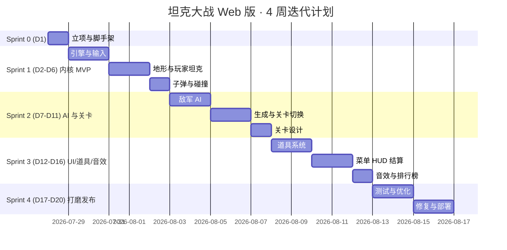

# 坦克大战 Web 版 · 分工与排期方案

## 1. 团队角色与职责
按最小可行团队 4 人配置（可按实际情况合并到 1~2 人独立开发）。

| 角色 | 代号 | 主要职责 | 交付物 |
|-----|-----|---------|-------|
| 产品/项目经理 | PM | 需求拆解、验收标准、里程碑跟进 | PRD、验收 checklist、Demo 视频 |
| 前端架构/游戏工程 | FE-Core | Vite 脚手架、React 外壳、GameEngine 主循环、ECS 系统、AI、碰撞 | `src/game/**`、GameEngine.ts、AISystem 等 |
| UI/美术工程 | FE-UI | 像素 sprite 绘制、菜单/HUD/结算界面、动画、Tailwind 主题 | `public/assets/sprites/*`、`pages/*`、HUD、PauseOverlay |
| 音效与测试 | QA-Audio | 8-bit 音效制作/接入、单元测试与手动测试、性能优化 | `public/assets/audio/*`、Vitest 用例、性能报告 |

> 若为单人开发：一人身兼四角，按下面里程碑串行执行，总工期约 3~4 周。

## 2. 里程碑总览（按 2 周一迭代，Sprint 长度 = 5 工作日）
| 迭代 | 起止（工作日） | 主题 | 里程碑 |
|-----|--------------|-----|-------|
| Sprint 0 | D1 | 立项 / 环境准备 | 仓库、脚手架就绪 |
| Sprint 1 | D2 – D6 | 游戏内核 MVP | 玩家可移动、可开火、可击毁砖墙 |
| Sprint 2 | D7 – D11 | 敌军 AI 与关卡系统 | 单关可通关（击杀 20 台） |
| Sprint 3 | D12 – D16 | UI/UX + 道具 + 音效 | 完整菜单、HUD、道具、音效 |
| Sprint 4 | D17 – D20 | 打磨、测试、发布 | 通过验收，产出可部署 build |

## 3. 详细任务分解与工时（人日）
| 编号 | 任务 | 负责人 | 工时 | 前置依赖 | 迭代 |
|-----|------|-------|-----|---------|-----|
| T-01 | 仓库初始化 + Vite+React+TS 脚手架 + ESLint/Prettier | FE-Core | 0.5 | – | S0 |
| T-02 | Tailwind + 全局像素样式（image-rendering: pixelated） | FE-UI | 0.5 | T-01 | S0 |
| T-03 | 路由骨架（/, /play, /leaderboard, /help） | FE-UI | 0.5 | T-01 | S0 |
| T-04 | 常量/类型/网格工具（constants.ts, grid.ts, types.ts） | FE-Core | 0.5 | T-01 | S1 |
| T-05 | GameEngine 主循环（RAF + fixed dt） | FE-Core | 1.0 | T-04 | S1 |
| T-06 | InputSystem（键盘映射，↑↓←→+WASD+空格+Esc） | FE-Core | 0.5 | T-05 | S1 |
| T-07 | 关卡数据 & 地形渲染（brick/steel/water/grass/ice/base） | FE-Core | 1.0 | T-05 | S1 |
| T-08 | 玩家坦克实体 + Movement + Render | FE-Core | 1.0 | T-06,T-07 | S1 |
| T-09 | Bullet + CollisionSystem（AABB + 网格）+ 砖墙破坏 | FE-Core | 1.5 | T-08 | S1 |
| T-10 | 坦克 sprite sheet 绘制（玩家 + 4 种敌军 4 方向） | FE-UI | 1.5 | – | S1 |
| T-11 | 地形 sprite sheet 绘制 | FE-UI | 1.0 | – | S1 |
| T-12 | 敌军 AI 有限状态机（Patrol/Chase/AttackBase/Retreat） | FE-Core | 1.5 | T-09 | S2 |
| T-13 | SpawnSystem（20 台/关、同屏 4 台、出生保护） | FE-Core | 1.0 | T-12 | S2 |
| T-14 | 基地判定 + Game Over 条件 | FE-Core | 0.5 | T-09 | S2 |
| T-15 | 关卡切换与"过关结算"流程 | FE-Core | 1.0 | T-13,T-14 | S2 |
| T-16 | 5 张关卡地图设计与调优 | PM+FE-UI | 1.0 | T-07 | S2 |
| T-17 | 道具系统（星/护盾/手雷/铲子/时钟/坦克） | FE-Core | 1.5 | T-13 | S3 |
| T-18 | 菜单页 UI（Logo/主菜单/闪烁指示器） | FE-UI | 1.0 | T-03 | S3 |
| T-19 | HUD 组件（关卡/敌军剩余/生命/分数） | FE-UI | 0.5 | T-15 | S3 |
| T-20 | 暂停/结算/Game Over 覆盖层 | FE-UI | 1.0 | T-15 | S3 |
| T-21 | 本地排行榜（localStorage）+ 昵称输入 | FE-UI | 1.0 | T-20 | S3 |
| T-22 | 音效制作与 AudioSystem 接入（射击/爆炸/道具/BGM） | QA-Audio | 1.5 | T-05,T-15 | S3 |
| T-23 | 单元测试（碰撞、AI 决策、排行榜工具） | QA-Audio | 1.0 | T-09,T-12,T-21 | S4 |
| T-24 | 兼容性 & 性能测试（Chrome/Firefox/Safari, 60 FPS） | QA-Audio | 1.0 | 全部 | S4 |
| T-25 | Bug 修复 & UX 打磨 | 全员 | 1.5 | 全部 | S4 |
| T-26 | 生产构建、README、部署脚本（Vercel/静态托管） | FE-Core | 0.5 | 全部 | S4 |
| T-27 | 验收 Demo + 录屏 | PM | 0.5 | T-26 | S4 |

**总工时**：约 24 人日 → 4 人并行下 **20 个工作日 / 4 周** 可完成 v1；单人开发建议规划 6~7 周。

## 4. 甘特图

## 5. 每迭代验收标准（Definition of Done）
- **Sprint 1**：`pnpm dev` 启动后，`/play` 页面能看到玩家坦克，可用方向键移动、空格射出子弹并击碎砖墙；60 FPS 稳定；`pnpm lint && pnpm typecheck` 通过。
- **Sprint 2**：进入 `/play` 后自动出现 4 台敌军并追击；20 台被击毁弹出"CONGRATULATIONS"，自动进入下一关；基地被击毁则 Game Over。
- **Sprint 3**：拥有完整菜单流程；道具随机出现并生效；有 8-bit 音效；本地排行榜可写入/展示 Top10。
- **Sprint 4**：Chrome/Firefox/Safari 全通过；Lighthouse Performance ≥ 90；`pnpm build` 产物 <500KB gzip；README 与部署链接完成。

## 6. 风险与应对
| 风险 | 概率 | 影响 | 应对 |
|-----|-----|-----|-----|
| Sprite 美术工作量被低估 | 中 | 延期 1–2 天 | 提前准备开源 8-bit 素材（CC0）作为回退 |
| Canvas 性能在低端笔记本 <60FPS | 中 | 体验下降 | 引入离屏 canvas 缓存地形层，仅重绘动态层 |
| AI 卡角/群体聚集 | 高 | 游戏感差 | Sprint 2 结束前预留 0.5 天调参 |
| 键盘按键冲突（浏览器快捷键） | 低 | 交互异常 | 游戏页监听 `keydown` 并 `preventDefault` |

## 7. 交付清单（v1）
1. 可访问的 Web Demo（本地 `pnpm dev` 或部署到静态托管）
2. 源码仓库（含 README、脚本 `dev/build/test/lint`）
3. 5 张可玩关卡
4. 中文/英文操作说明
5. 演示视频（≤ 2 分钟）

---
> 本方案文档位于 [.trae/documents/](file:///Users/puqingrui/workspace/Projects/TankWar/.trae/documents)，包括 [prd.md](file:///Users/puqingrui/workspace/Projects/TankWar/.trae/documents/prd.md)、[technical-architecture.md](file:///Users/puqingrui/workspace/Projects/TankWar/.trae/documents/technical-architecture.md) 与本文件 [schedule-and-roles.md](file:///Users/puqingrui/workspace/Projects/TankWar/.trae/documents/schedule-and-roles.md)。
