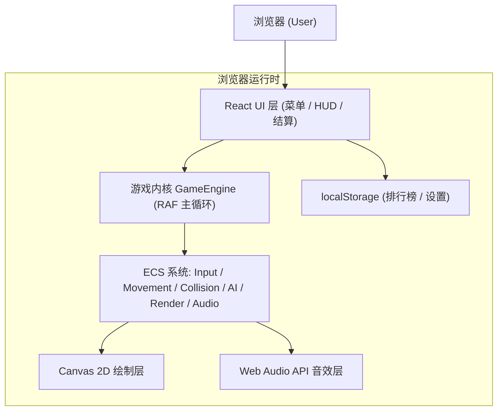

# 坦克大战 Web 版 · 技术架构文档

## 1. 架构设计
本项目为纯前端单机游戏，无后端与数据库依赖，所有状态与数据在浏览器内运行/持久化。整体采用"React 外壳 + Canvas 游戏内核"的分层架构。



## 2. 技术描述
- **前端框架**：React@18 + TypeScript@5
- **构建工具**：Vite@5（使用 `pnpm create vite tankwar --template react-ts`）
- **样式方案**：Tailwind CSS@3（仅用于菜单/HUD/排行榜等 DOM 层）
- **游戏渲染**：原生 `<canvas>` 2D Context（不引入 Phaser 等重型引擎，控制包体积并保持像素级掌控）
- **状态管理**：Zustand@4（管理菜单 <-> 游戏场景切换、设置、排行榜等应用级状态）
- **音频**：Web Audio API + 自制 8-bit `.wav`/`.mp3` 素材（或运行时合成方波）
- **测试**：Vitest + @testing-library/react（工具函数与关键逻辑单测）
- **代码质量**：ESLint + Prettier + TypeScript strict 模式
- **后端**：无
- **数据库**：无（本地排行榜使用 `localStorage`）

## 3. 路由定义
| 路由 | 用途 |
|-----|------|
| `/` | 开始菜单页（Logo + 主菜单） |
| `/play` | 游戏主场景，承载 Canvas |
| `/leaderboard` | 本地排行榜页 |
| `/help` | 操作说明页 |

## 4. 目录结构
```
tankwar/
├─ index.html
├─ package.json
├─ vite.config.ts
├─ tsconfig.json
├─ tailwind.config.js
├─ public/
│  └─ assets/
│     ├─ sprites/tanks.png        # 坦克 sprite sheet
│     ├─ sprites/tiles.png        # 地形 sprite sheet
│     └─ audio/*.wav              # 8-bit 音效
└─ src/
   ├─ main.tsx                    # React 入口
   ├─ App.tsx                     # 路由 + 全局样式
   ├─ store/
   │  ├─ gameStore.ts             # zustand: scene, level, score, lives
   │  └─ settingsStore.ts         # 音量、按键映射
   ├─ pages/
   │  ├─ MenuPage.tsx
   │  ├─ PlayPage.tsx             # 挂载 <GameCanvas />
   │  ├─ LeaderboardPage.tsx
   │  └─ HelpPage.tsx
   ├─ game/
   │  ├─ GameEngine.ts            # 主循环 (requestAnimationFrame)
   │  ├─ constants.ts             # TILE_SIZE=32, MAP=13, FPS=60
   │  ├─ types.ts                 # Entity, Direction, TileType
   │  ├─ maps/levels.ts           # 关卡地图数据 (二维数组)
   │  ├─ entities/
   │  │  ├─ Tank.ts               # 基础坦克
   │  │  ├─ PlayerTank.ts
   │  │  ├─ EnemyTank.ts          # 含 4 种敌军变体
   │  │  ├─ Bullet.ts
   │  │  └─ PowerUp.ts
   │  ├─ systems/
   │  │  ├─ InputSystem.ts        # 键盘事件 -> intent
   │  │  ├─ MovementSystem.ts
   │  │  ├─ CollisionSystem.ts    # AABB + 网格
   │  │  ├─ AISystem.ts           # 敌军 FSM
   │  │  ├─ RenderSystem.ts       # 绘制到 canvas
   │  │  ├─ SpawnSystem.ts        # 敌军生成
   │  │  └─ AudioSystem.ts
   │  └─ utils/
   │     ├─ grid.ts               # 世界坐标 <-> 网格坐标
   │     └─ rng.ts
   ├─ components/
   │  ├─ GameCanvas.tsx           # useRef + engine.mount(canvas)
   │  ├─ HUD.tsx
   │  ├─ PauseOverlay.tsx
   │  └─ ResultOverlay.tsx
   ├─ hooks/
   │  ├─ useKeyboard.ts
   │  └─ useLocalStorage.ts
   └─ styles/
      └─ index.css                # Tailwind + pixel-perfect 全局样式
```

## 5. 核心模块设计

### 5.1 GameEngine 主循环
- 使用 `requestAnimationFrame`，固定逻辑步长 `dt = 1/60`（累加时间片，避免掉帧引发穿墙）。
- 每帧顺序：`InputSystem.update() → AISystem.update() → MovementSystem.update() → CollisionSystem.resolve() → SpawnSystem.tick() → RenderSystem.draw() → AudioSystem.flush()`
- 引擎通过 `mount(canvas)` 接入 React；React 侧通过 zustand 订阅 `score/lives/level` 更新 HUD，避免频繁 setState。

### 5.2 实体模型 (TypeScript 类型)
```ts
type Direction = 'up' | 'down' | 'left' | 'right';
type TileType = 'empty' | 'brick' | 'steel' | 'water' | 'grass' | 'ice' | 'base';

interface Entity {
  id: number;
  x: number;    // 像素坐标
  y: number;
  w: number;
  h: number;
  dir: Direction;
  alive: boolean;
}

interface Tank extends Entity {
  kind: 'player' | 'basic' | 'fast' | 'power' | 'armor';
  hp: number;
  speed: number;
  cooldown: number;
  level: 0 | 1 | 2 | 3;  // 玩家火力等级
}

interface Bullet extends Entity {
  ownerId: number;
  fromEnemy: boolean;
  power: 1 | 2;    // 2 可打钢
}
```

### 5.3 碰撞检测
- 使用"AABB + 网格空间划分"：地形按 `13×13` 网格索引，坦克在移动前预计算下一位置矩形，先与地形网格求交，再与其他坦克/子弹求交。
- 子弹与地形：击中 brick 时按方向消除 2 格；击中 steel 时若 `power===2` 则消除，否则反弹销毁。

### 5.4 敌方 AI（有限状态机）
- 状态：`Patrol` → `Chase` → `AttackBase` → `Retreat`
- 触发条件：出生 3s 内 Patrol；玩家在 5 格内切 Chase；基地暴露路径最短切 AttackBase；HP 低切 Retreat。
- 决策频率：每 500ms 重新评估一次，避免抖动。

### 5.5 关卡数据
关卡以 13×13 二维数字数组定义（0 空 / 1 砖 / 2 钢 / 3 水 / 4 草 / 5 冰 / 9 基地），存放于 `src/game/maps/levels.ts`，v1 内置 5 关。

## 6. 数据模型（本地存储）

### 6.1 数据结构
```ts
interface LeaderboardEntry {
  name: string;    // 3 字母大写
  score: number;
  level: number;
  createdAt: number;  // Date.now()
}

interface Settings {
  volume: number;    // 0..1
  muted: boolean;
  keymap: Record<'up'|'down'|'left'|'right'|'fire'|'pause', string>;
}
```

### 6.2 localStorage 键
| Key | Value |
|-----|-------|
| `tankwar_leaderboard` | `LeaderboardEntry[]` (JSON, 最大 10 条) |
| `tankwar_settings` | `Settings` (JSON) |

## 7. 性能与兼容性预算
- 帧率：60 FPS，单帧预算 16ms（渲染 <6ms，逻辑 <4ms）。
- 内存：<50MB，实体池化（Bullet / Explosion 复用）。
- 兼容浏览器：Chrome / Edge / Firefox / Safari 最近 2 个大版本。
- 包体积：首屏 gzip < 200KB（JS） + 100KB（sprite）。

## 8. 风险与对策
| 风险 | 影响 | 对策 |
|-----|-----|-----|
| Canvas 与 React 状态频繁同步 | 掉帧 | 引擎内自持状态，React 仅通过 zustand 订阅 HUD 关键字段 |
| 敌军 AI 集体卡角落 | 体验差 | 500ms 决策 + Patrol 阶段随机转向；对同格坦克加入排斥力 |
| 定时器与 tab 切换 | 音画不同步 | 使用 RAF + `document.visibilitychange` 暂停引擎 |
| 键盘按住浏览器滚动 | 页面抖动 | 全局 `preventDefault` 于游戏页；菜单页仅监听 keydown |
